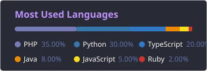

<h1 align="center">Hi there👋, I'm GiauPhan</h1>

### A developer from Vietnam
- 🧬 System architecture; AI pipeline; MCP ecosystem
- 🔧 Building **AI-powered developer tools** and automated data pipelines
- 🐲 Full-stack dev; Web scraping & automation; DevOps
- ⚡ I ship open-source packages and automate everything

### Statistics

### 🔆 Areas of interest
- AI pipeline & automation (Gemini API, MCP, Chrome DevTools Protocol)
- System architecture & DevOps (Docker, Redis queues, Cloudflare WARP)
- Web scraping & browser automation (Playwright, Puppeteer, Goutte)
- Full-stack web apps (Laravel, Next.js, NestJS, Vue, React)
- VS Code extension development
- Open-source package publishing (npm, Packagist)

### Languages and Tools

<!-- lang -->

<!-- frameworks -->

<!-- ai & automation -->

<!-- infra -->

<!-- tools -->

### Social

